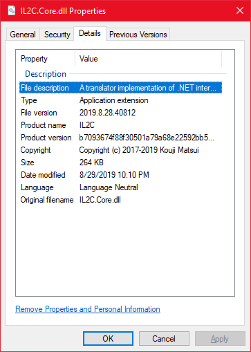
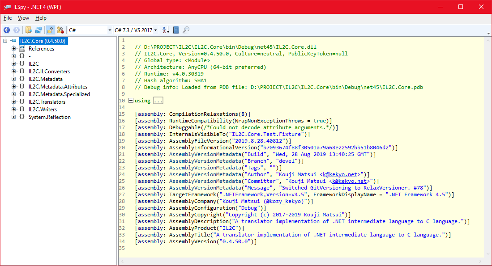

# RelaxVersioner


[English language is here](https://github.com/kekyo/CenterCLR.RelaxVersioner)

# Status

[](https://www.repostatus.org/#active)

| | master | devel |
|:---|:---|:---|
| Packages | [](https://www.nuget.org/packages/RelaxVersioner) | [](https://www.myget.org/feed/kekyo/package/nuget/RelaxVersioner)
| Continuous integration | [](https://github.com/kekyo/CenterCLR.RelaxVersioner/actions) | [](https://github.com/kekyo/CenterCLR.RelaxVersioner/actions)

## これは何？
* RelaxVersionerは、軽量で非常に簡単に使用することが出来る、Gitベースの「自動バージョニング」ツールセットです。.NET Core/.NET Frameworkベースのソースコードを対象としていて、ビルド時にアセンブリ属性を自動的に適用します。
* RelaxVersionerを使うと、Gitのタグ・ブランチ・コミットメッセージだけを使って、バージョン管理が出来ます。つまり、追加のツール操作が不要なため、Gitを知ってさえいれば学習コストがほとんどなく、CI環境にも容易に対応できます。
* サポートしている言語と環境は:
  * C#・F#・VB.NET・C++/CLI、そしてNuGetパッケージング (dotnet cli packコマンド)
  * Visual Studio 2019/2017/2015, dotnet SDK cli, netcoreapp2.1/net461の元で動作するMSBuild環境 (注: MSBuildの動作プラットフォームの事です、あなたがターゲットにしたいプロジェクトの事ではありません)、及びこれらを使用する任意のIDE。
  * Linux(x64)及びWindows(x86/x64)  （検証している環境は先のとおりですが、[libgit2sharp](https://github.com/libgit2/libgit2sharp)の動作要件に準じて動作する可能性があります）
* ローカルのGitリポジトリから、自動的にタグ・ブランチの名称を取得し、アセンブリ属性に適用することが出来ます。
* AssemblyInfo.csファイルを直接変更しません。RelaxVersionerはテンポラリファイルに定義を出力し、それをコンパイルさせます。
* Visual Studio/MSBuildの中間出力フォルダーを自動的に使用するため、Gitリポジトリ内を汚すことがありません。
* カスタムルールセットを定義することで、出力する属性と内容をカスタマイズすることが出来ます。

### バージョン情報が埋め込まれた、Explorerで見るアセンブリのプロパティ



### バージョン情報が埋め込まれた、ILSpyで見るアセンブリの属性群



## 出力されるコードの例:

### For C#:

``` csharp
using System.Reflection;
[assembly: AssemblyVersionAttribute("0.5.30.0")]
[assembly: AssemblyFileVersionAttribute("2016.1.15.41306")]
[assembly: AssemblyInformationalVersionAttribute("a05ab9fc87b22234596f4ddd43136e9e526ebb90")]
[assembly: AssemblyVersionMetadataAttribute("Build","Fri, 15 Jan 2016 13:56:53 GMT")]
[assembly: AssemblyVersionMetadataAttribute("Branch","master")]
[assembly: AssemblyVersionMetadataAttribute("Tags","0.5.30")]
[assembly: AssemblyVersionMetadataAttribute("Author","Kouji Matsui <k@kekyo.net>")]
[assembly: AssemblyVersionMetadataAttribute("Committer","Kouji Matsui <k@kekyo.net>")]
[assembly: AssemblyVersionMetadataAttribute("Message","Fixed tab")]
```

### For F#:

``` fsharp
namespace global
  open System.Reflection
  [<assembly: AssemblyVersionAttribute("0.5.30.0")>]
  [<assembly: AssemblyFileVersionAttribute("2016.1.15.41306")>]
  [<assembly: AssemblyInformationalVersionAttribute("a05ab9fc87b22234596f4ddd43136e9e526ebb90")>]
  [<assembly: AssemblyVersionMetadataAttribute("Build","Fri, 15 Jan 2016 13:56:53 GMT")>]
  [<assembly: AssemblyVersionMetadataAttribute("Branch","master")>]
  [<assembly: AssemblyVersionMetadataAttribute("Tags","0.5.30")>]
  [<assembly: AssemblyVersionMetadataAttribute("Author","Kouji Matsui <k@kekyo.net>")>]
  [<assembly: AssemblyVersionMetadataAttribute("Committer","Kouji Matsui <k@kekyo.net>")>]
  [<assembly: AssemblyVersionMetadataAttribute("Message","Fixed tab")>]
  do()
```

### For VB.NET:

``` visualbasic
Imports System.Reflection
<Assembly: AssemblyVersionAttribute("0.5.30.0")>
<Assembly: AssemblyFileVersionAttribute("2016.1.15.41306")>
<Assembly: AssemblyInformationalVersionAttribute("a05ab9fc87b22234596f4ddd43136e9e526ebb90")>
<Assembly: AssemblyVersionMetadataAttribute("Build","Fri, 15 Jan 2016 13:56:53 GMT")>
<Assembly: AssemblyVersionMetadataAttribute("Branch","master")>
<Assembly: AssemblyVersionMetadataAttribute("Tags","0.5.30")>
<Assembly: AssemblyVersionMetadataAttribute("Author","Kouji Matsui <k@kekyo.net>")>
<Assembly: AssemblyVersionMetadataAttribute("Committer","Kouji Matsui <k@kekyo.net>")>
<Assembly: AssemblyVersionMetadataAttribute("Message","Fixed tab")>
```

### For C++/CLI:

``` cpp
using namespace System::Reflection;
[assembly: AssemblyVersionAttribute("0.5.30.0")];
[assembly: AssemblyFileVersionAttribute("2016.1.15.41306")];
[assembly: AssemblyInformationalVersionAttribute("a05ab9fc87b22234596f4ddd43136e9e526ebb90")];
[assembly: AssemblyVersionMetadataAttribute("Build","Fri, 15 Jan 2016 13:56:53 GMT")];
[assembly: AssemblyVersionMetadataAttribute("Branch","master")];
[assembly: AssemblyVersionMetadataAttribute("Tags","0.5.30")];
[assembly: AssemblyVersionMetadataAttribute("Author","Kouji Matsui <k@kekyo.net>")];
[assembly: AssemblyVersionMetadataAttribute("Committer","Kouji Matsui <k@kekyo.net>")];
[assembly: AssemblyVersionMetadataAttribute("Message","Fixed tab")];
```

## RelaxVersionerの使い方

### スタートガイド
[Refer start guides. (英語)](./STARTGUIDE.md)

### 簡単な使い方
* NuGetで["RelaxVersioner"](https://www.nuget.org/packages/RelaxVersioner/)を検索して、導入してください。
* (.NET Coreではない旧形式のMSBuildプロジェクトを使っている場合): あらかじめ、AssemblyInfo.cs等に定義されている、デフォルトの"AssemblyVersion"と"AssemblyFileVersion"属性をコメントアウトして下さい（ビルド時に重複定義エラーが発生します）。
  * これらはカスタムルールを用いて定義を除外するのであれば、引き続き使用する事もできます。
* ビルドすると、自動的にアセンブリ属性が適用されます。[ILSpy](https://github.com/icsharpcode/ILSpy)等で確認するか、一部の属性はエクスプローラーのプロパティから確認することが出来ます。
* プロジェクトフォルダ、又はソリューションフォルダに"RelaxVersioner.rules"ファイルを配置することで、カスタムルールを定義出来ます。カスタムルールファイルの定義例を参照してください。

### 開発運用の例
1. C#・F#などでプロジェクトを新規に作ります。
2. NuGetで"RelaxVersioner"を検索して、プロジェクトに追加します。
3. (オプション): AssemblyInfo.csなどに定義されている、デフォルトの"AssemblyVersion"と"AssemblyFileVersion"属性をコメントアウトします。
4. この状態でビルドするだけで、バージョンが適用されたバイナリが生成されます。
  * デフォルトでは、AssemblyVersionが"0.0.1.0"、AssemblyFileVersionがビルド時の日時を2秒精度でバージョン化した値（例:"2016.05.12.11523"）となります。
  * また、AssemblyVersionMetadataに、ローカルGitリポジトリから得られる情報が埋め込まれます（Author・ブランチ・タグなど）。しかし、この例ではまだgit initしてないので"Unknown"として埋め込まれます。
5. ソリューションフォルダでgit initして適当にコミットしてください。
6. この状態でビルドすると、Author・ブランチやコミットメッセージが埋め込まれます。
7. 現在のコミットにタグをつけてください。例えば"0.5.4"や"v0.5.4"のようなバージョン表記です。これでビルドすれば、このバージョン番号が自動的にAssemblyVersionに反映されるようになります。
  * 自動バージョンインクリメント機能: 現在のコミットにタグが無い場合は、過去のコミットに辿っていって、最初に見つかった有効なタグからのコミット数に応じて、バージョンの末尾が自動的にインクリメントされます。例えば、2つ祖先のコミットに"0.5.4"というタグが付いていた場合、自動的に計算されるバージョンは"0.5.6"になります。
  * コミットの分岐がマージされている場合は、プライマリ分岐を優先して探索します。つまり、ブランチ運用をしている場合は、ブランチを切った際に、それぞれにタグをつけておくことで、異なるブランチで異なる自動バージョンインクリメントの法則を適用できます。例えば、masterブランチに"1.0.0"、develブランチに"1.1.0"と、タグを適用することで、チックタックモデルを実現できます。
8. 全て良ければ、リモートリポジトリにpushして完了です。
9. 以後、コードを変更してリリースの準備が出来たら、新たにタグをつければそれがAssemblyVersionに反映されるので、ビルドしてバイナリをリリースします。
  * dotnet cliを使用してNuGetのパッケージをビルドする場合にも、`PackageVersion`と`PackageReleaseNotes`は自動的に適用されます。完成してデプロイする場合は、`dotnet pack`コマンドを使えば、NuGetのバージョンを一元管理できます。

## カスタムルールファイル(RelaxVersioner.rules)の例:

``` xml
<?xml version="1.0" encoding="utf-8"?>
<RelaxVersioner version="1.0">
  <WriterRules>
    <!-- Target languages -->
    <Language>C#</Language>
    <Language>F#</Language>
    <Language>VB</Language>
    <Language>C++/CLI</Language>
    
    <Import>System.Reflection</Import>
    
    <!--
      "versionLabel" is extract numerical-notate version string [1.2.3.4] or [v1.2.3.4] from git repository tags traverse start HEAD.
      If not found, use [0.0.1].
    -->
    <Rule name="AssemblyVersionAttribute">{versionLabel}</Rule>
    
    <!--
      "safeVersion" is extract committed date (from commmiter) from git repository HEAD.
      "safeVersion" specialized from "committer.When".
      (The format is safe-numerical-notate version string [2016.2.14.12345]. (Last number is 2sec prec.))
    -->
    <Rule name="AssemblyFileVersionAttribute">{safeVersion}</Rule>
    
    <!--
      "commitId" is extract commit id from git repository HEAD.
      "commitId" alias to "commit.Sha".
    -->
    <Rule name="AssemblyInformationalVersionAttribute">{commitId}</Rule>
    
    <!--
      "key" attribute is only using for "AssemblyVersionMetadataAttribute".
      "committer.When" or you can use another choice "author.When".
      "branch" can use property "FriendlyName" and "CanonicalName". (Derived from libgit2sharp)
      "author" and "committer" can use property "Name", "Email", and "When". (Derived from libgit2sharp)
      "buildIdentifier" is passing from MSBuild property named "RelaxVersionerBuildIdentifier" or "BuildIdentifier". We can use in CI building.
      "generated" is generated date by RelaxVersioner.
    -->
    <Rule name="AssemblyVersionMetadataAttribute" key="Date">{committer.When:R}</Rule>
    <Rule name="AssemblyVersionMetadataAttribute" key="Branch">{branch.FriendlyName}</Rule>
    <Rule name="AssemblyVersionMetadataAttribute" key="Tags">{tags}</Rule>
    <Rule name="AssemblyVersionMetadataAttribute" key="Author">{author}</Rule>
    <Rule name="AssemblyVersionMetadataAttribute" key="Committer">{committer}</Rule>
    <Rule name="AssemblyVersionMetadataAttribute" key="Message">{commit.MessageShort}</Rule>
    <Rule name="AssemblyVersionMetadataAttribute" key="Build">{buildIdentifier}</Rule>
    <Rule name="AssemblyVersionMetadataAttribute" key="Generated">{generated:R}</Rule>
  </WriterRules>
</RelaxVersioner>
```

## TIPS

もしCIプロセスで使ったときに、以下のようなエラーが発生した場合:

```
RelaxVersioner[1.0.13.0]: NotFoundException=object not found -
   no match for id (a2b834535c00e7b1a604fccc28cfebe78ea0ec31),
   Unknown exception occurred, ...
```

これは、CIプロセスのワークスペースにリポジトリをcloneした際に、
最も新しいコミットだけをcloneしてきたために(検索するコミットが見つからないため)発生します。
常に全てのコミットをcloneする必要があります。

例えば、GitHub Actionsの `checkout@v2` タスクは、デフォルトで常に最新のコミットだけをcloneします。
何故なら、それが最も高速に処理できるからです。

RelaxVersioner (や、その他の自動バージョニングツール) は、
正しいバージョン番号を計算するために、全てのコミットを必要とします。

そのため、build.yml (GitHub Actionsのスクリプト) に、
`fetch-depth: 0` を追加して下さい。
[このリポジトリで実際に使用している例を参照できます。](https://github.com/kekyo/RelaxVersioner/blob/master/.github/workflows/build.yml#L13)

## その他
* RelaxVersionerをVisual Studio 2012/2013で使うには、システムに.NET Framework 4.6以上がインストールされている必要があります。RelaxVersionerは、MSBuild.Frameworkアセンブリのnet46以上のバージョンを必要とするためです。

## TODO:
* 除外ルールのサポート
* ネイティブC++プロジェクトに対応させる
* テンプレート出力をサポートする
* フォールバックルールを指定可能にする
* Mono環境のサポート

## License
* Copyright (c) 2015-2019 Kouji Matsui (@kozy_kekyo, @kekyo2)
* Under Apache v2

## 履歴
* 1.0.10:
  * プロジェクト参照先のパッケージバージョンを誤って解釈する問題を修正 (NuGetの内部実装の変更による)
* 1.0.5:
  * まだタグを適用していない場合に、常にバージョンが0.0.1となる問題を修正。
* 1.0.0:
  * 正式版1.0公開 🎉
  * MSBuild Taskアセンブリによる実装を完全に削除し、独立したコマンドライン実行ファイルを使用するように変更 (MSBuild Taskアセンブリは非常に多くの問題を抱えているため)。
* 0.10.24:
  * MSBuild net40/net45プラットフォームのサポートを削除しました (MSBuild.Frameworkアセンブリのバージョン競合に対して安全な回避方法が見いだせなかったため)。
* 0.10.19:
  * 未初期化のリポジトリに対して使用した場合にクラッシュする不具合を修正しました。
* 0.10.17:
  * 分岐の解析を強化しました。
* 0.10.11:
  * MSBuild net40/net45プラットフォームへの実験的なサポート (これは、VS2012-2013に対応しますが、未テストです)
  * MSBuild utilityアセンブリへの依存を削除しました。
* 0.10.6:
  * 未初期化のリポジトリに対して使用した場合にクラッシュする不具合を修正しました。
* 0.10.3:
  * バージョンのオートインクリメント機能を追加しました。
  * ブランチ名からバージョン番号を推測する機能を削除しました。
  * ルールフォーマットを若干変更しました（互換性に影響があります）
* 0.9.69:
  * ビルドした最終出力にruntimeディレクトリが含まれていた問題を修正しました。
* 0.9.67:
  * ブランチ名を取得できていない問題を修正しました。
* 0.9.66:
  * Linux環境でGitリポジトリから情報を取得できていなかったのを修正しました。
  * ロギング構造を改善しました。
  * CIによる検証で、.NET Core 2を対象としたものを強化しました。
* 0.9.62:
  * .NET Core 2のdotnet cliからのビルドに対応 (WindowsとLinux環境)
* 0.9.25:
  * セルフホストバージョニングを開始 :)
  * develとmasterブランチに分割
  * CIをAzure Pipelinesに変更 (作業中)
  * Linux環境を検証 (作業中)
* 0.9.14:
  * developmentDependency属性を追加し、RelaxVersionerパッケージへの依存を排除しました。
* 0.9.13:
  * dotnet cliからビルドした場合に、ライブラリのロードに失敗していたのを修正。
  * NuGetのパッケージをビルドした場合 (dotnet pack) に、PackageVersionにバージョンを反映させるようにした。
* 0.9.1:
  * 新しいMSBuildスクリプトの形式に対応しました (つまり、.NET Core 2/.NET Standardに使われる新しい形式のプロジェクトで使用できます)
  * LibGit2Sharpを0.26.1/2.0.289に更新しました。
  * WiXサポートを削除しました。
* 0.8.30:
  * Importエレメントに対応 (Thanks @biobox)
* 0.8.20:
  * Ruleエレメントが複数存在する場合に複数の属性を定義してエラーが発生する問題を修正 (Thanks @zizi4n5)
  * NuGetパッケージがdevelopmentDependencyとなっていないのを修正 (Thanks @zizi4n5)
  * labelのバージョン番号の先頭に'v'が付与されている場合に無視するように修正 (Thanks @zizi4n5)
  * NuGetパッケージの更新をMSBuild内で行うように変更 (Thanks @biobox)
* 0.8.11:
  * メタデータ情報の埋め込みは、常にAssemblyVersionMetadataAttributeを使用するように変更しました。以前はmscorlib::AssemblyMetadataAttributeを使う場合がありましたが、NET4・PCL環境で不可視のためにトラブルが起きる事がありました。
  * まだコミットされていないGitリポジトリを使った場合の、デフォルトのバージョンとして"0.0.1.0"を使うように変更しました。以前は"0.0.0.0"でしたが、コンパイラによっては警告を発していました。
  * LibGit2Sharpを0.22.0/1.0.129に更新しました。
* 0.8.3:
  * Wixプロジェクトのサポート (未完了)
* 0.8.2:
  * Mono環境のサポート (未完了・詳しい方のPRウェルカム)
* 0.8.1:
  * ルールセットの "Rules" を "WriterRules" に変更 (Breaking change)
  * "gitLabel" のフォールバック値を "safeVersion" から、固定の "0.0.0.0" に変更
  * ビルド時に、適用されたバージョンを出力するようにした
  * ソースコード上のタブを修正
* 0.7.18:
  * PCLプロジェクトで、AssemblyMetadataAttributeが見つからない問題を修正
* 0.7.17:
  * TargetPathに対応するフォルダが存在しない環境（CI等）で例外が発生していた問題を修正
* 0.7.16:
  * libgit2sharpとNamingFormatterを更新
* 0.7.14:
  * SemVerで使用される、プレフィックス・ポストフィックスを除外してバージョン番号をパースするように変更
  * Gitリポジトリのトラバース方法を変更し、TagsについてはHEADコミットのみを参照するように変更
* 0.7.13:
  * コミットメッセージなどにソースコード非互換の文字列が含まれている場合にビルドが失敗するのを修正。例: Dirty\String"Test"
* 0.7.12:
  * まだコミットがないリポジトリを使用した場合にクラッシュする問題を修正
* 0.7.11:
  * {branches} と {tags} フォーマットを追加
* 0.7.10:
  * NamingFormatterを使うように変更
  * System.Version.Parseを使うように変更
* 0.7.7:
  * 最新のタグの検索漏れを修正
* 0.7.6:
  * 古い .NET Framework (2.0-3.5) に対応
* 0.7.5:
  * プロジェクトフォルダからルートフォルダに向かってgitリポジトリを検索するように変更
  * gitリポジトリが見つからないか、コミットが存在しないような場合でも、ダミーの属性を生成するようにしてエラーを回避した
* 0.7.1: カスタムルールセットファイルに対応
* 0.5.30: 4言語で動作確認
* 0.5.0: Initial public commit. (Broken, still under construction)
